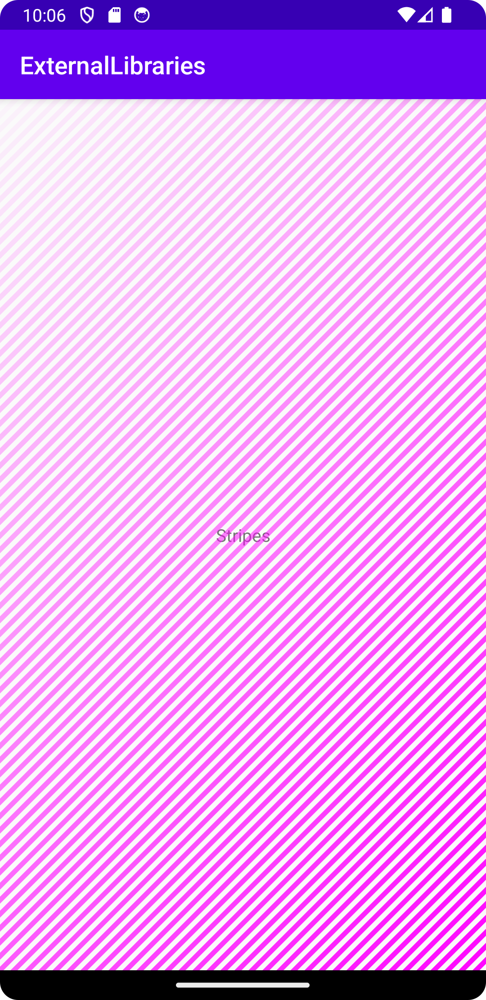

# Rapport

Jag har implementerat ett external library som heter "DashedView". Jag lade till en dashed view
i activity_main och lade till kod i MainActivity för att ge viewen en gradient. Jag hittade min view
med det givna id:t och assignade sedan en DashColorGenerator till min view med en gradient.
Denna gradient var ett exempel från skaparen och den behövde översättas från Kotlin.

```
        DashedView dash1 = findViewById(R.id.dashed);

        dash1.setDashColorGenerator(new DashColorGenerator() {
            @Override
            public int getPaintColor(int curIndex, int numDashes) {
                float alphaValue = 255 * ((curIndex + 1) / (float) (numDashes + 1));
                int gradientAppliedColor = Color.argb((int) alphaValue, 255, 0, 255);
                return gradientAppliedColor;
            }
        });
```

